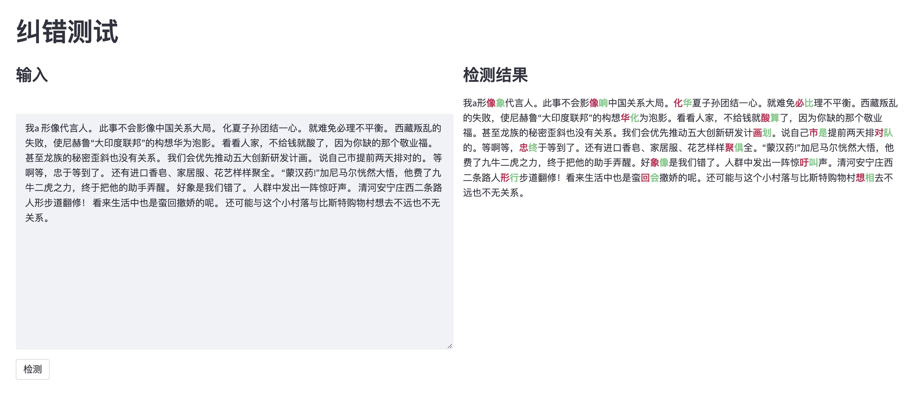

# 中文纠错

开源前段时间做的纠错模型。大体上没什么创新，主要就是用了wiki-edit的数据，自己测试下来效果还行。

> TL;DR - 数据是最重要的！

对比[pycorrector](https://github.com/shibing624/pycorrector#Evaluate)的纠错结果：

|模型|ACC|P|R|F1|
|----|----|----|----|----|
|Corpus500|||||
|bert/MLM|-|0.8643|0.4047|0.5513|
|macbert/csc|-|0.9133|0.5987|0.7232|
|cbert|0.588|0.746|0.4716|0.5779|
|cbert+finetune|0.7820|0.9481|0.6722|0.7867|
|roberta+finetune|0.774|**0.9604**|0.6488|0.7745|
|plome+finetune|**0.7920**|0.9493|**0.6890**|**0.7984**|
|Sighan15|||||
|macbert/csc||0.8254|0.7311|0.7754|
|cbert+finetune|0.7627|0.8322|0.6494|0.7295|

> 这里算的是句子级别的指标。

可以看到其实语料作用挺大的，单纯用roberta进行finetune的效果就好过了macbert/csc了。

cbert是👇提到的错别字模型，在收集的语料上进行finetune。

plome是用plome开源的cbert模型进行finetune，可以看到效果会更好一些。

Sighan15上效果不如macbert/csc，可能主要的原因是cbert没有用[Wang271K](https://github.com/wdimmy/Automatic-Corpus-Generation)进行训练，只用我自己收集的数据训练的。

## 错别字

针对1-1形式的纠错，包括音近、音同、形近字的纠错。

### Demo

plome+finetune的模型开源出来供大家测试：

[链接，密码: l47p](https://pan.baidu.com/s/16ioz3LcAowDWv-A5_My2Ig)

要跑代码里面的demo的话，需要以下依赖：

- Streamlit
- flask
- tensorflow==1.15

如果运行出错的话看看还差哪些包吧。在cbert目录下：

- 先运行`python serving.py`把纠错服务启动，需要自己把模型地址改一下
- 再运行`streamlit run demo.py`

然后就可以在前端测试了，界面如下，可以发现还是有误报漏报的。

### 预训练

尝试过[PLOME](https://github.com/liushulinle/PLOME)，为了简化模型就没有用拼音和字形的信号作为输入了，采用了论文中提到的cbert模型。

自己构造了字的音近、形近以及词的音近混淆集来进行预训练，数据采用了[微信语料](https://github.com/nonamestreet/weixin_public_corpus)+[新闻语料](https://github.com/brightmart/nlp_chinese_corpus#2%E6%96%B0%E9%97%BB%E8%AF%AD%E6%96%99json%E7%89%88news2016zh)。

具体来说就是将bert的MLM任务中的mask变成了用混淆集替换，这样与下游任务更一致。

### Fintune

finetune的数据采用了：

- [wiki-error-extract](https://github.com/xueyouluo/wiki-error-extract)的方法从维基百科的编辑历史中收集到的平行语料（维基历史数据太大，我只抽取了部分），同时用混淆集对错误进行了过滤
- 开源的中文纠错数据集，比如nlpcc，sighan的训练数据，只保留`len(src)==len(tgt)`的数据
- 部分我们自己收集的错误平行数据，量较少

总共468K的平行语料，对前面预训练的模型进行了finetune。

综合测试下来基于PLOME开源的cbert进行finetune效果会更好一些😂。这里面影响的因数较多，比如训练语料、训练步数、采样策略、混淆集等，我就不去调参了，有个还可以的就行了。

### 改进

可以改进的方面挺多的，比如：

- 预训练方面
  - 更丰富的训练语料来预训练模型
  - 采样策略、混淆集构建都是可以尝试的方向
- decode方面
  - 解码输出时如果发现某个位置有错误，那么正确的token只能在混淆集的空间输出，但可能漏掉单纯的别字错误
  - 用语言模型进行过滤
  - 借鉴[DCN](https://github.com/destwang/DCN)的方法来解决连续位置出错的情况

## 语法错误

这里只解决部分语法错误，不包括类似搭配不当、句式杂糅、语义重复等，只处理简单的多字、少字、重复、错位等问题。

正常的话大家应该都是用S2S的方法来解决这类问题，我们也试过用T5在构造的伪数据上进行finetune，效果其实还可以。我这里主要是想试试别的方法，尝试了一下[GECToR](https://github.com/grammarly/gector)。本质上来说这个方法也是基于序列标注的，只是它的标签设计的比较巧妙，让1-1的预测也能解决N-N的问题。

### 预训练

这块的话主要是自己拍脑袋确定了构造伪数据的方法，如随机插入或删除字词、调换顺序、字词替换等。然后利用伪数据构建了标签集合，在roberta模型的基础上用GECToR模型进行训练。

### Finetune

与前面类似，只是把条件放宽了一些，因此数据达到了1M的量级。

但是用自己划分的测试集跑了一下，句子级别的准确率只有22%左右。看了一下finetune数据本身，感觉是因为NLPCC数据有1-N的情况，把它们拆成1-1效果并不好，会给模型带来挺大的干扰，在训练阶段本身的准确率也不高，不到30%。

综合来看，这里也是需要高质量的finetune语料会更好一些。

